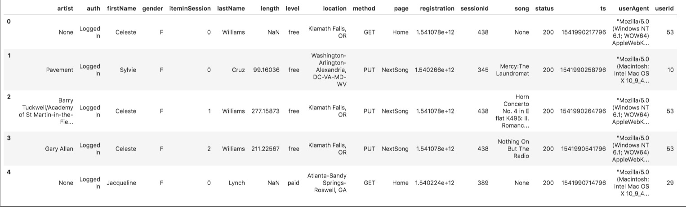
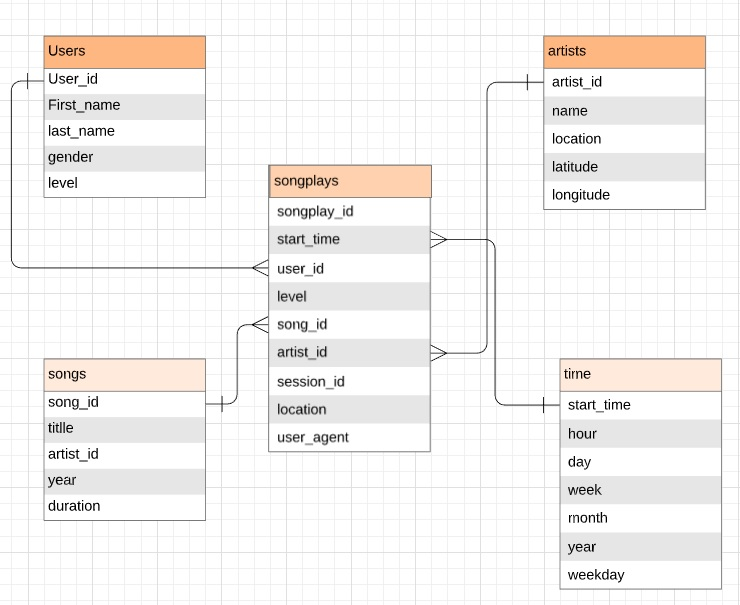
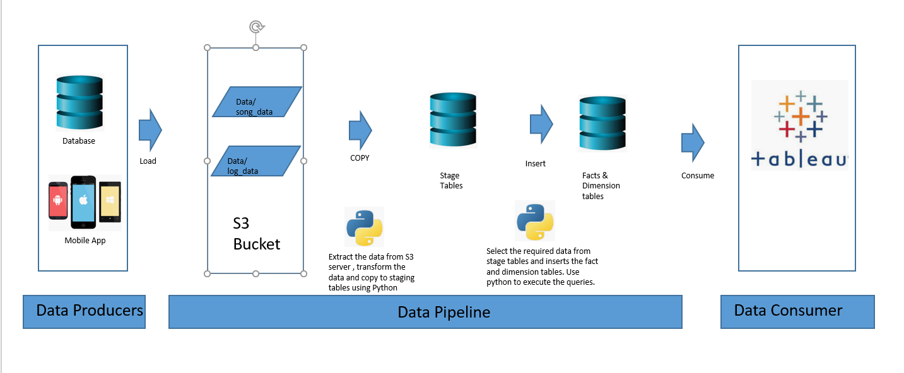
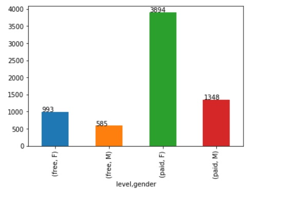
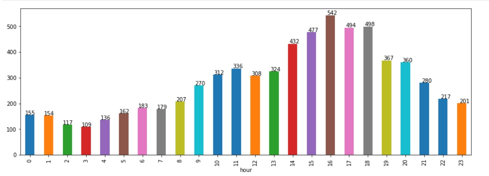
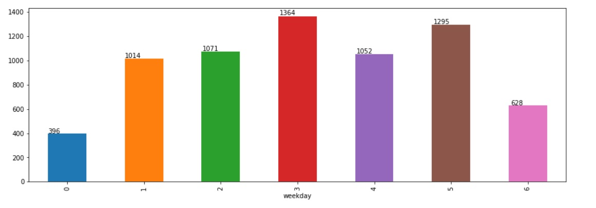

# Project Title: Data Warehouse in AWS
## Introduction
A music streaming startup, Sparkify, has grown their user base and song database and want to move their processes and data onto the cloud. Their data resides in S3, in a directory of JSON logs on user activity on the app, as well as a directory with JSON metadata on the songs in their app.

As a data engineer build an ETL pipeline that extracts their data from S3, stages them in Redshift, and transforms data into a set of dimensional tables for their analytics team to continue finding insights in what songs their users are listening to.

## Project Description
In this project, create a database schema and ETL pipeline for this analysis. Do data modeling for database hosted on Redshift  and build an ETL pipeline using Python. To complete the project, define fact and dimension tables for a star schema for a particular analytic focus, and write an ETL pipeline that transfers data from S3 bucket to staging tables and execute sql statements to move the data from staging to fact and deimentison tables.

## Getting Started

- Check the Data in S3 bucket
- Create AWS account
- Install python 3.6.3
- Install below required python packages 
 1. configparser - To read config file and get the parameters
 2. psycopg2- to connect to postgres or redshift cluster database 
 3. datetime - to get the date and time 
 4. boto3 - used for creating client/resources for aws services.
 5. json - to handle json files
 6. pandas - data analysis library 

## Project Steps
1. Create IAM and Redshift clients.
2. Create IAM role and attach policies that has read access to S3.
3. Create a Redshift cluster and retain endpoint.
4. Create a psycopg2 client to connect to endpoint.
5. Drop and create database schema.
6. Drop and create database tables.
7. Load raw data from S3 to staging tables.
8. Clean / transform data in staging tables and load to dimensional model.
9. Run validation queries.

## Tests

- Use Create_cluster pyhton notebook to create cluster ,test  creation of tables and load data . 

## Data 

The Data resides in S3 bucket with JSON logs on user activity on the app, as well as a directory with JSON metadata on the songs in their app.

### Song Dataset

The first dataset is a subset of real data from the Million Song Dataset. Each file is in JSON format and contains metadata about a song and the artist of that song. The files are partitioned by the first three letters of each song's track ID. For example, here are filepaths to two files in this dataset.

song_data/A/B/C/TRABCEI128F424C983.json
song_data/A/A/B/TRAABJL12903CDCF1A.json

And below is an example of what a single song file, TRAABJL12903CDCF1A.json, looks like.

*{"num_songs": 1, "artist_id": "ARJIE2Y1187B994AB7", "artist_latitude": null, "artist_longitude": null, 
"artist_location": "", "artist_name": "Line Renaud", "song_id": "SOUPIRU12A6D4FA1E1", "title": "Der Kleine Dompfaff", "duration": 152.92036, "year": 0} *

### Log Dataset

The second dataset consists of log files in JSON format generated by this event simulator based on the songs in the dataset above. These simulate activity logs from a music streaming app based on specified configurations.

The log files in the dataset are partitioned by year and month. For example, here are filepaths to two files in this dataset.
log_data/2018/11/2018-11-12-events.json
log_data/2018/11/2018-11-13-events.json

And below is an example of what the data in a log file, 2018-11-12-events.json, looks like.

## Database schema

### Tables
Below are the tables need to be defined

1. Staging Table
    1. staging_events
        this table hosts the data from log data
        - artist ,auth ,first_name ,gender ,item_in_session ,last_name ,length ,level,location ,method ,page ,registration ,session_id ,song ,status , ts ,user_agent ,user_id 
    2. staging_songs
        this table hosts the data from song data 
        - num_songs , artist_id , artist_latitude , artist_longitude , artist_location , artist_name , song_id ,title ,duration, year 
2. Fact Table
 1. songplays - records in log data associated with song plays i.e. records with page NextSong
  -  songplay_id, start_time, user_id, level, song_id, artist_id, session_id, location, user_agent
3. Dimension Tables
 1. users - users in the app
  -  user_id, first_name, last_name, gender, level
 2. songs - songs in music database
  -  song_id, title, artist_id, year, duration
 3. artists - artists in music database
  -  artist_id, name, location, latitude, longitude
 4. time - timestamps of records in songplays broken down into specific units
  -  start_time, hour, day, week, month, year, weekday
  
#### Distrubution of the tables in redshift

- Users Table : Sort the table beased on user_id and DISTSTYLE ALL as the table is very small 
As below dimension tables are large enough not storing in all the nodes and distributing beased on the keys

- time : dist key is start time 
- artists : dist key is artist_id
- songs : dist key is song_id

Fact table is having so many nulls for song id and artist id. So distrubting the table bease on start_time

- songplays : dist key is start_time

### ER Diagram

ER diagram depicting the tables fact and dimensions.

## Data Pipeline

Below shows how we are going to design the pipeline

## Scripts which does the job

### sql_queries.py 
    contains all your sql queries, and is imported into the create_tables, etl.py 
    
### create_tables.py
    drops and creates your tables. You run this file to reset your tables before each time you run your ETL scripts.
    
    how to run :  python create_tables.py

### etl.py
    etl.py copies the data from S3 to staging tables and load fact and dimension tables from staging tables.
    
    how to run : python  etl.py
    

## Some of Analysis on the songs plays

### Chart showing songs streamed by level and gender

Insights: 

    Female users stream songs more than male users
    Paid users stream more than free users
    

### Chart showing songs on a particular hour

Insights:
    
    Most of songs are streamed from 10 am to 9 pm and 4 pm being the most streamed hour

### Chart showing songs streamed on a weekday

Insights:
    
    Songs streaming increases from Monday(0) and gradually decresing on weekends( 5, 6). 
    Most of the songs streamed on Thursday(3)
    